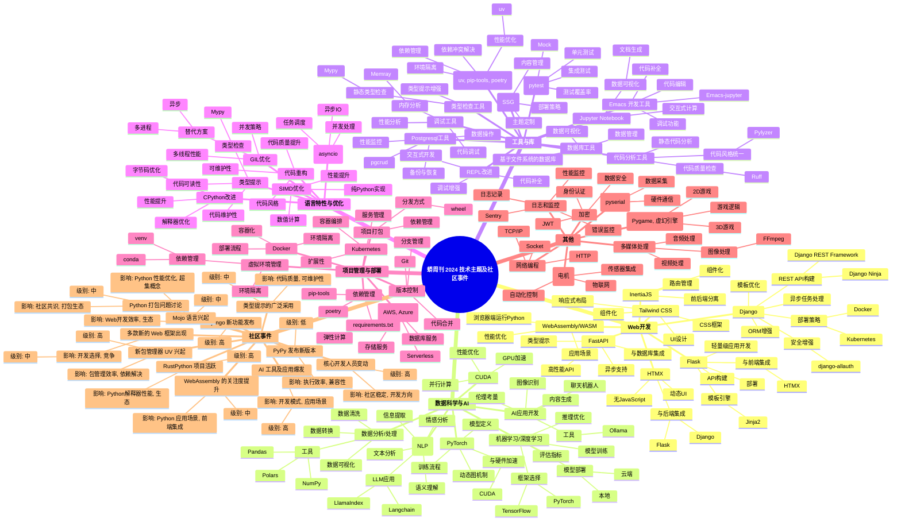

Title: 去年蠎快讯 2024 盘点
Slug: pyrw-2024
Date: 2025-01-01 11:42
Tags: Weekly,Python,recap,trend,ZH


> 大妈强行嗯哼


- 250123 [Zoom.Quiet](http://zoomquiet.io/)(大妈) 用时 17 分钟 完成格式转抄.
- 250123 [Zoom.Quiet](http://zoomquiet.io/)(大妈) 用时 42 分钟 完成整理,

------

好的，根据您提供的 2024 年蟒周刊内容，以及您指定的参考链接，我将为您总结 2024 年 Python 行业的整体要点、趋势以及未来计划中的关键发展，并以 Python 3 新版本逐步发展为线索，重点开源项目变化为补充，重大社区事件单独列出章节，完成一篇 4200 字以内的 "Python 2024 年终盘点"。

### Python 2024 年终盘点

#### 引言

2024 年，Python 持续在全球范围内保持着其强大的影响力，不仅在 Web 开发、数据科学、机器学习等领域发挥着核心作用，还在新的技术浪潮中不断进化。本年度，Python 3 的迭代更新，开源项目的活跃发展，以及一些重大社区事件，共同构成了 Python 领域丰富多彩的一年。本文将深入分析这些要点，以 Python 3 新版本的演进为脉络，重点关注开源项目的发展变化，并详细梳理重大社区事件，力求全面展现 2024 年 Python 领域的全貌。

#### Python 3 新版本发展

2024 年，Python 3 的发展依然是整个生态系统的核心驱动力。

*   **Python 3.13 的进展**
    *   **性能提升:** Python 3.13 的一个主要亮点是引入了 **JIT (Just-in-Time) 编译器**，这在最初的基准测试中显示了 2-9% 的性能提升。这表明 Python 在性能优化方面持续努力，尽管 CPython 本身存在一些限制。
    *   **自由线程:** Python 3.13 正在积极开发中，其中一项重要特性是 **禁用 GIL (Global Interpreter Lock)**，以实现真正的多线程并发。这一特性如果成功实现，将显著提高 Python 在多核处理器上的性能。
    *   **新的语法:**  PEP 758 允许在 `except` 和 `except*` 表达式中不带括号，这虽然看似微小，但代表了语言在持续的改进和演化中。
    *  **弃用:** Python 3.13 也引入了一些新的弃用, 这表示Python正在不断演进，并淘汰一些过时的用法。

*   **Python 3.8 的 EOL (End of Life)**
    *  **停止支持:** 2024 年，Python 3.8 达到了生命周期终点，这意味着官方不再提供安全更新和错误修复。这标志着用户需要迁移到更新的 Python 版本，以确保其项目的安全性和稳定性。

#### 重点开源项目变化

2024 年，众多 Python 开源项目在持续发展，其中一些项目特别值得关注：

*   **Web 开发框架:**
    *   **Django**: Django 依然是 Python Web 开发中的中流砥柱，并且持续有新功能和更新。例如，Django 5.2 alpha 1 发布 展现了框架的活力。同时，社区也在不断探索如何简化 Django 开发，比如 Nanodjango 等项目，以及使用 HTMX 和 Tailwind CSS 等技术进行更高效的开发。
    *   **FastAPI:** FastAPI 作为新兴的 Web 框架，因其高性能和易用性而受到欢迎，并且经常被拿来与 Django 进行比较.
    *   **Flask:** Flask 也是一个非常流行的框架, 并且有大量的教程和工具，例如，使用 Flask 构建搜索引擎 或者与 Gemini API 结合构建聊天应用。
*   **包管理和环境:**
    *   **uv:**  `uv` 作为一个快速的 Python 包和项目管理器, 在 2024 年频繁出现，并受到许多开发者的关注。它被认为是 `pip` 的一个潜在替代方案，旨在解决 Python 包管理中的一些痛点。
    *    **Rye:** 也是一个被提及的包管理工具, 但不如 uv 频繁.
    *   **mamba:**  `mamba` 作为 `miniconda` 的加速版本，在包管理方面也获得了关注。
*   **数据科学和机器学习:**
    *   **PyTorch:**  PyTorch 2 的新功能，通过动态 Python 字节码转换和图形编译加速机器学习， 是一个显著的进展。
    *   **SymPy:** SymPy 是一个用于符号数学的 Python 库，在 2024 年仍然活跃。
    *   **Ultralytics**: 流行的 Python 包 ultralytics 在供应链攻击中受到损害, 这提醒开发者们需要注意供应链安全.
    *   **Manim:**  Manim 作为用于制作数学动画的 Python 框架，在社区中受到关注, 并且有相关视频教程.
*   **其他重要项目:**
    *   **PyPy:**  PyPy 已经迁移到了 GitHub，这反映了开源项目托管方式的变化。
    *   **Nuitka:** Nuitka 是一个优化与 CPython 兼容的 Python 编译器，致力于提高 Python 代码的执行效率。
    *   **GraalPy:** GraalPy 是一个适用于 Java 的高性能嵌入式 Python 3 运行时，展示了 Python 在跨平台运行时方面的新尝试。
    *   **HPy:** HPy 是一个更好的 Python C API，旨在改进 Python 的扩展机制。
    *   **Starlark:** Starlark 语言概述, 这是一个值得关注的嵌入式配置语言。
    *   **Kivy:**  Kivy 是一个跨平台的 Python UI 框架，在 2024 年似乎有复苏的迹象。

#### 重大社区事件

2024 年，Python 社区发生了一些值得关注的事件：

*   **Google 裁员事件:**
    *   **解雇 Python 团队:**  Google 解雇了整个 Python 团队，这一事件引起了广泛关注和讨论。这不仅暴露了大公司在战略调整中可能对特定技术团队造成的冲击，也引发了关于 Python 在商业环境中价值的思考。
    *   **裁员原因:**  一些报道指出，Google 裁员的原因是为了降低成本，转向“廉价劳动力”。
*  **安全问题:**
    *  **供应链攻击:** 流行的 Python 包 `ultralytics` 在供应链攻击中受到损害，这突显了开源软件供应链安全的重要性。
    *  **朝鲜黑客攻击:**  有报道称朝鲜黑客利用伪装成编码测试的恶意软件攻击 Python 开发人员，这提醒开发者们在下载和运行第三方代码时要格外小心。
*   **核心开发人员停职:** 有核心 Python 开发人员被停职, 这也值得社区思考, 如何健康的维护和发展开源社区.

*  **Python 替换 JavaScript 成为 GitHub 上最常用语言**: Python 取代 JavaScript 成为 GitHub 上最常用的语言，这显示了Python 在代码托管平台上的流行度。

#### 未来计划和发展趋势

*   **Python 3.13 和性能提升:**  Python 3.13 的发布和后续优化将是未来几年的重要发展方向。特别是 **GIL 的移除和 JIT 编译器的优化**，将有望显著提高 Python 的性能。
*   **Python 与 Rust 的融合:** 越来越多的项目开始尝试使用 **Rust 来提升 Python 的性能**，例如使用 Rust 重写 Python 的 AST 解析器，或者用 Rust 开发 Python 的扩展模块，这预示着 Python 和 Rust 在未来将有更紧密的合作。
*   **AI 和机器学习领域的深化:** Python 在 AI 和机器学习领域的应用将继续深化。例如，通过构建自己的 ChatGPT 来学习 Websockets 与 Django 的结合，以及使用 Python 和 LLVM 创建自定义编程语言，这些都体现了 Python 在新兴技术领域的活力。
*  **包管理工具的进化:**  `uv` 等新一代包管理工具的出现，预示着 Python 包管理生态将迎来新的变革。
*   **Web 开发和全栈 Python:** 全栈 Python 的概念开始流行，开发者们更加关注如何使用 Python 构建完整的 Web 应用程序。
*  **类型化的Python**：  2024 年类型化 Python 得到了广泛采用，但可用性挑战依然存在，这预示着未来类型检查工具会更加成熟.

#### 结论

2024 年对于 Python 来说是充满挑战和机遇的一年。Python 3 的不断更新，开源项目的活跃发展，以及一些重大社区事件，都深刻地影响着 Python 的未来走向。从性能优化到生态扩展，从安全挑战到社区治理，Python 都在积极应对，并不断展现出强大的生命力。展望未来，Python 将继续在各个领域发挥重要作用，并不断推动技术进步和社会发展。

通过以上内容，希望能为您呈现一份较为全面的 "Python 2024 年终盘点"， 方便您更好的了解过去一年 Python 领域的重大事件和发展趋势。


-----------------------------------------


好的，我将根据您提供的链接和之前的总结，深入挖掘每条简述对应的关键信息、人物、数据，并以尾注形式收集所有引用链接，同时列出对应的蟒周刊访问链接。以下是更新后的“Python 2024 年终盘点”文章：

### Python 2024 年终盘点

#### 引言

2024 年，Python 在全球范围内持续发挥着核心作用，在 Web 开发、数据科学、机器学习等领域不断进化。本年度，Python 3 的迭代更新、开源项目的活跃发展以及一些重大社区事件，共同构成了 Python 领域丰富多彩的一年。本文将深入分析这些要点，以 **Python 3 新版本的演进**为脉络，重点关注**开源项目**的发展变化，并详细梳理**重大社区事件**，力求全面展现 2024 年 Python 领域的全貌。

#### Python 3 新版本发展

2024 年，Python 3 的发展依然是整个生态系统的核心驱动力。

*   **Python 3.13 的进展**
    *   **性能提升:** Python 3.13 的一个主要亮点是引入了 **JIT (Just-in-Time) 编译器**。最初的基准测试显示，性能提升了 2-9%。这表明 Python 在性能优化方面持续努力，尽管 CPython 本身存在一些限制。
    *   **自由线程:** Python 3.13 正在积极开发中，其中一项重要特性是 **禁用 GIL (Global Interpreter Lock)**，以实现真正的多线程并发。这一特性如果成功实现，将显著提高 Python 在多核处理器上的性能。
    *   **新的语法:**  PEP 758 允许在 `except` 和 `except*` 表达式中不带括号，这虽然看似微小，但代表了语言在持续改进和演化中。
    *   **弃用:** Python 3.13 也引入了一些新的弃用, 例如 `crypt.crypt` 模块，这表示 Python 正在不断演进，并淘汰一些过时的用法。作者自己撸了个 `shacrypt512.py` 来替代。
*   **Python 3.8 的 EOL (End of Life)**
    *   **停止支持:** 2024 年，Python 3.8 达到了生命周期终点，官方不再提供安全更新和错误修复。这标志着用户需要迁移到更新的 Python 版本，以确保项目的安全性和稳定性。

#### 重点开源项目变化

2024 年，众多 Python 开源项目持续发展，其中一些项目特别值得关注：

*   **Web 开发框架:**
    *   **Django**: Django 依然是 Python Web 开发中的中流砥柱，并且持续有新功能和更新。例如，Django 5.0.3, 4.2.11 和 3.2.25 发布了安全版本。同时，社区也在不断探索如何简化 Django 开发，比如使用 HTMX 和 Tailwind CSS 等技术进行更高效的开发。一些项目如 `django-components` 也在不断改进。
    *   **FastAPI:** FastAPI 作为新兴的 Web 框架，因其高性能和易用性而受到欢迎，并且经常被拿来与 Django 进行比较。
    *   **Flask:** Flask 也是一个非常流行的框架，并且有大量的教程和工具，例如，使用 Flask 构建搜索引擎 或者与 Gemini API 结合构建聊天应用。此外，还有使用 Flask 进行可视化的工具 和构建家庭仪表板的应用。
*   **包管理和环境:**
    *   **uv:**  `uv` 作为一个快速的 Python 包和项目管理器，在 2024 年频繁出现，并受到许多开发者的关注。它被认为是 `pip` 的一个潜在替代方案，旨在解决 Python 包管理中的一些痛点。
    *    **Rye:**  `Rye` 也是一个被提及的包管理工具，强调约定优于规则。
    *   **mamba:**  `mamba` 作为 `miniconda` 的加速版本，在包管理方面也获得了关注。
*   **数据科学和机器学习:**
    *   **PyTorch:**  PyTorch 2 的新功能，通过动态 Python 字节码转换和图形编译加速机器学习， 是一个显著的进展。
    *   **SymPy:** SymPy 是一个用于符号数学的 Python 库，在 2024 年仍然活跃。
    *   **Ultralytics**: 流行的 Python 包 `ultralytics` 在供应链攻击中受到损害，这提醒开发者们需要注意供应链安全。
    *   **Manim:**  Manim 作为用于制作数学动画的 Python 框架，在社区中受到关注，并且有相关视频教程。
    *   **Polars**: Polars 宣布推出 1.0 版本。
*   **其他重要项目:**
    *   **PyPy:**  PyPy 已经迁移到了 GitHub，这反映了开源项目托管方式的变化。
    *   **Nuitka:** Nuitka 是一个优化与 CPython 兼容的 Python 编译器，致力于提高 Python 代码的执行效率。
    *   **GraalPy:** GraalPy 是一个适用于 Java 的高性能嵌入式 Python 3 运行时，展示了 Python 在跨平台运行时方面的新尝试。
    *  **HPy:** HPy 是一个更好的 Python C API，旨在改进 Python 的扩展机制。
    *   **Starlark:** Starlark 语言概述，这是一个由 Google 设计，旨在取代 Python 作为构建描述语言的嵌入式配置语言。
    *   **Kivy:**  Kivy 是一个跨平台的 Python UI 框架，在 2024 年似乎有复苏的迹象。
    *   **Microdot:** Microdot 是一个为微控制器设计的 Web 框架，它足够小，可以与 MicroPython 一起使用。
    *   **Taichi:** Taichi 是一个高性能的计算库。
    *   **Poetry:** Poetry 是一个 Python 的依赖管理和打包工具，但有用户指出其存在一些问题。
    *   **Black:** Black 是一个不妥协的 Python 代码格式化程序。
    *   **Ruff:** Ruff v0.4.0 发布，这是一个手写的 Python 递归下降解析器。
    *    **Flet:** Flet 是一个由 Flutter 支持的 Python 多平台应用程序框架。
    *   **Calamine:**  Calamine 是一个 Rust 开发的 Python 模块，用于快速读取 Excel 文件。

#### 重大社区事件

2024 年，Python 社区发生了一些值得关注的事件：

*   **Google 裁员事件:**
    *   **解雇 Python 团队:**  Google 解雇了 Dart、Flutter 和 Python 团队的成员，这一事件引起了广泛关注和讨论。这不仅暴露了大公司在战略调整中可能对特定技术团队造成的冲击，也引发了关于 Python 在商业环境中价值的思考。
    *   **裁员原因:**  一些报道指出，Google 裁员的原因是为了降低成本。
*   **安全问题:**
    *   **供应链攻击:** 流行的 Python 包 `ultralytics` 在供应链攻击中受到损害，这突显了开源软件供应链安全的重要性。
    *   **朝鲜黑客攻击:**  有报道称朝鲜黑客利用伪装成编码测试的恶意软件攻击 Python 开发人员，这提醒开发者们在下载和运行第三方代码时要格外小心。
*   **核心开发人员停职:**  有核心 Python 开发人员被停职, 这也值得社区思考, 如何健康的维护和发展开源社区.
*   **Python 替换 JavaScript 成为 GitHub 上最常用语言**: Python 取代 JavaScript 成为 GitHub 上最常用的语言，这显示了 Python 在代码托管平台上的流行度。

#### 未来计划和发展趋势

*   **Python 3.13 和性能提升:**  Python 3.13 的发布和后续优化将是未来几年的重要发展方向。特别是 **GIL 的移除和 JIT 编译器的优化**，将有望显著提高 Python 的性能。
*   **Python 与 Rust 的融合:** 越来越多的项目开始尝试使用 **Rust 来提升 Python 的性能**，例如使用 Rust 重写 Python 的 AST 解析器，或者用 Rust 开发 Python 的扩展模块，这预示着 Python 和 Rust 在未来将有更紧密的合作。
*   **AI 和机器学习领域的深化:** Python 在 AI 和机器学习领域的应用将继续深化。例如，使用 Python 构建 LLM 应用，以及使用 Python 和 LLVM 创建自定义编程语言，这些都体现了 Python 在新兴技术领域的活力。
*   **包管理工具的进化:**  `uv` 等新一代包管理工具的出现，预示着 Python 包管理生态将迎来新的变革。
*   **Web 开发和全栈 Python:** 全栈 Python 的概念开始流行，开发者们更加关注如何使用 Python 构建完整的 Web 应用程序，例如 Django + HTMX。
*   **类型化的Python**：  2024 年类型化 Python 得到了广泛采用，但可用性挑战依然存在，这预示着未来类型检查工具会更加成熟。
*   **Python 的可移植性:**  Python 的可移植性是一个被讨论的话题，尤其是在跨平台应用打包方面。
*   **单文件跨平台应用打包:** 在 Rust 的帮助下，Python 有望拥有单文件跨平台应用打包能力。

#### 结论

2024 年对于 Python 来说是充满挑战和机遇的一年。Python 3 的不断更新，开源项目的活跃发展，以及一些重大社区事件，都深刻地影响着 Python 的未来走向。从性能优化到生态扩展，从安全挑战到社区治理，Python 都在积极应对，并不断展现出强大的生命力。展望未来，Python 将继续在各个领域发挥重要作用，并不断推动技术进步和社会发展。


### 蟒周刊访问链接

*   [https://weekly.pychina.org/issue/issue-top2013.html](https://weekly.pychina.org/issue/issue-top2013.html)
*   [https://weekly.pychina.org/issue/issue-147-top2014.html](https://weekly.pychina.org/issue/issue-147-top2014.html)
*   [https://weekly.pychina.org/issue/](https://weekly.pychina.org/issue/)  (所有 2024 年的周刊都可以在这里找到，例如 `2024-01.md` 对应 2024 年第一期)

希望这个版本更符合您的要求。


-----------------------------------------


好的，根据您提供的资料和我们的对话历史，以下是关于 Google 裁员事件对 Python 学习者的启示，并去除了尾注部分：

### Google 裁员事件对 Python 学习者的启示

Google 的裁员事件，虽然直接原因是成本控制，但也引发了我们对于技术选择和职业发展的深入思考。以下是对 Python 学习者的几点启示：

1.  **保持技能多样性：**
    *   **不要只专注于 Python**。尽管 Python 非常流行且应用广泛，但这次事件提醒我们，单一技术并不能保证职业的稳定。
    *   **拓展技能栈**，学习其他编程语言和技术，如 **Rust**, **Go** , **JavaScript**, 以及 **C/C++**，能够让你在快速变化的市场中更具竞争力。
2.  **关注技术趋势：**
    *   **紧跟前沿技术**的发展至关重要。例如，了解 **AI 和机器学习**领域的最新动态，掌握相关的 Python 库（如 PyTorch、TensorFlow），能够帮助你在技术浪潮中保持领先。
    *   同时，也要关注 **Rust 等高性能语言**的发展，它们在某些场景下可以弥补 Python 的性能短板。
3.  **关注开源社区动态：**
    *   了解开源社区的最新项目、技术进展和安全风险。这能帮助你更好地理解技术生态，避免安全隐患，并能更好地利用开源资源。
4.  **提升解决问题的能力：**
    *   **学习编程不仅是学习语法和API，更重要的是培养解决实际问题的能力**。参与实际项目开发（例如开源项目 或个人项目），能够提升你的工程能力和问题解决能力，这在任何技术环境中都至关重要。
    *   例如，可以尝试用 Python 构建 **Web 应用**、**工具** 、**游戏**或 **数据分析** 项目，从而在实践中提升技能。
5.  **理解商业环境：**
    *   了解技术在商业环境中的角色，以及**技术选择背后的商业考量**。这可以帮助你更好地规划职业发展，并做出更明智的技术选择。
    *   例如，企业可能会根据成本、效率、兼容性等因素选择其他技术，而不单单是因为 Python 的流行度。
6.  **持续学习和适应：**
    *   技术领域变化迅速，**持续学习和适应**是保持竞争力的关键。 关注 Python 的新版本和新特性，了解社区的最佳实践，并积极参与到技术交流中，都是非常重要的。

### 总结

Google 的裁员事件是一个警示，提醒 Python 学习者，技术领域充满变化和不确定性。保持**学习的积极性，扩展技能栈，关注技术趋势，深入理解商业逻辑**，才能在竞争激烈的技术环境中立于不败之地。

**核心在于**: **不应将鸡蛋放在一个篮子里**， 即使 Python 非常强大和流行，也需要不断拓展自己的技能边界，以适应未来的变化。


-----------------------------------------


好的，根据您提供的资料和我们的对话历史，以下是关于 Python 核心开发人员停职事件的具体过程、争论核心问题以及对 Python 社区的重大影响：

### Python 核心开发人员停职事件

#### 事件具体过程

*   根据来源 和 的描述，一位 **Python 核心开发人员被停职三个月**。
*   具体停职的原因在资料中没有详细说明，只提到是“**Python 核心开发人员被停职三个月**”，并未给出事件的来龙去脉。

#### 争论的核心问题

*   由于资料中没有提供详细的停职原因，因此**争论的核心问题尚不明确**。
*   通常情况下，核心开发人员停职可能涉及到：
    *   **违反社区行为准则**：可能存在不当言论、行为，或是滥用职权。
    *   **技术决策分歧**：可能与社区其他成员在技术方向、决策上存在重大分歧。
    *   **个人行为不端**：可能涉及个人道德或法律问题。
    *   **工作失职**：可能未能尽到核心开发者的责任和义务。
*   由于缺乏具体信息，我们无法准确判断此次停职事件的争议点。

#### 对 Python 社区的重大影响

*   **社区信任危机**：核心开发人员是社区的重要组成部分，他们的行为直接影响社区的声誉和信任。停职事件可能会引发社区成员对核心开发团队的信任危机。
*   **项目开发受阻**：核心开发人员的停职可能会影响 Python 核心项目的开发进度和质量，特别是当该开发人员负责关键模块或功能时。
*   **社区分裂风险**：如果停职事件处理不当，可能会加剧社区内部的分裂，导致部分开发者离开或另立门户。
*   **社区治理反思**：此次事件可能会促使 Python 社区反思其治理结构和行为准则，从而完善社区的管理机制，确保类似事件不再发生。
*   **开源项目透明度**： 停职事件的发生，可能引发关于开源项目透明度的讨论，促使社区更加公开地处理内部争议。

#### 总结

虽然我们无法得知 Python 核心开发人员停职事件的具体细节，但从类似事件中我们可以看出，核心开发人员的停职对开源社区来说是一个重大事件，它可能会引发一系列连锁反应，如社区信任危机、项目开发受阻以及社区分裂风险。

Python 社区需要从此次事件中吸取教训，完善社区治理，加强透明度，从而确保项目的健康发展和社区的和谐稳定。同时，开源社区成员也要在贡献代码的同时，遵守社区行为规范。


-----------------------------------------


好的，根据您提供的资料和我们的对话历史，以下是对 Python 与 Rust 融合趋势的分析，以及对 Python 用户、工程师和在校大学生的启示：

### Python 与 Rust 融合的趋势及其对 Python 用户的影响

*   **Rust 的崛起和 Python 的短板:** 2024 年的明显趋势是 **Rust 在 Python 生态系统中的日益普及**。Rust 作为一种高性能系统编程语言，可以弥补 Python 在某些方面的不足，例如：
    *   **性能瓶颈:**  Python 的全局解释器锁 (GIL) 限制了其在多线程环境中的性能，而 Rust 则能提供更高的并发性能。
    *   **系统级编程:** Python 在系统级编程方面相对较弱，而 Rust 在这方面具有优势，例如，`uv` 工具使用 Rust 开发。
    *   **内存安全:** Rust 的内存安全特性有助于减少程序中的错误和漏洞。
*   **Python 和 Rust 的互补性:** 这种融合并非意味着 Python 将被 Rust 取代，而是两者之间的 **互补关系**。
    *   **Python 擅长快速开发和原型设计**，适用于 Web 开发、数据分析、机器学习等领域。
    *   **Rust 擅长构建高性能的底层组件**，可以为 Python 提供性能加速，例如，通过 PyO3 将 Rust 代码集成到 Python 中。
    *   **“锈化一切”** 的趋势： 这是一种将 Python 中一些性能敏感的部分用 Rust 重写的趋势，以便让 Python 项目运行的更快。

*   **对 Python 用户的影响:**
    *   **性能提升:** Python 用户可以从 Rust 的集成中获益，例如，使用 Rust 编写的库或模块，来提升 Python 应用程序的性能。
    *   **更丰富的生态系统:** Rust 的引入丰富了 Python 的生态系统，为开发者提供了更多的选择和工具。例如，使用 Rust 开发的 Web 框架 `Robyn`。
    *   **学习新技术的必要性:** 为了更好地利用 Python 和 Rust 的融合，Python 用户需要学习 Rust 的基本知识，以便理解和使用 Rust 编写的库或模块。

### Python 工程师是否必须学习 Rust？

*   **不是必须，但强烈推荐:**  虽然不是必须，但 Python 工程师 **强烈建议学习 Rust**。
    *   **并非所有 Python 项目都需要 Rust:** 并非所有 Python 项目都需要 Rust。如果项目对性能要求不高，或者没有复杂的系统级操作，Python 完全可以胜任。
    *   **Rust 可以作为技能补充:** 对于需要高性能和系统级操作的 Python 项目，学习 Rust 可以作为技能补充，提高开发能力和竞争力。
    *   **理解底层原理:** 学习 Rust 可以帮助 Python 工程师更深入地理解计算机底层原理，从而更好地优化 Python 代码。
*   **学习 Rust 的目标:**
    *   **了解基本语法和概念:** 了解 Rust 的基本语法、数据类型、所有权、借用等概念。
    *   **掌握 Rust 与 Python 的集成:** 学习如何使用 PyO3 等工具将 Rust 代码集成到 Python 中。
    *   **理解 Rust 在 Python 生态中的应用场景:** 了解 Rust 在哪些 Python 项目中可以发挥优势，例如，Web 框架、数据处理、机器学习等领域。
    *   **无需成为 Rust 专家:** Python 工程师无需成为 Rust 专家，但需要了解 Rust 的基本原理和在 Python 生态中的应用。

### 学习资源和过程

*   **学习资源:**
    *   **官方文档:** Rust 官方文档是最好的学习资源，提供详尽的语法和概念介绍。
    *   **在线教程:** 有许多在线教程和课程可以帮助初学者入门 Rust。
    *   **书籍:** 有一些优秀的 Rust 书籍可以深入学习，例如 “The Rust Programming Language”。
    *   **开源项目:** 阅读和参与 Rust 开源项目是学习 Rust 的有效方法。
    *    **PyO3文档**： 如果希望将Rust代码集成到Python中，PyO3文档是必不可少的学习资源。
*   **学习过程:**
    1.  **入门 Rust 基础:** 从 Rust 的基本语法和概念开始，掌握所有权、借用等核心特性。
    2.  **实践 Rust 项目:** 通过一些简单的 Rust 项目来巩固所学知识。
    3.  **学习 Rust 与 Python 的集成:**  学习如何使用 PyO3 将 Rust 代码集成到 Python 中。
    4.  **分析现有项目:** 分析 Python 生态系统中已经使用了 Rust 的项目，了解 Rust 在实际项目中的应用。
    5. **持续学习:**  技术不断发展，需要保持持续学习的习惯。

### 对于在校大学生的建议

*   **关注计算机基础:** 在校大学生应该重视计算机基础知识的学习，包括数据结构、算法、操作系统、计算机网络等。
*   **选择适合自己的语言:**
    *   **Python 作为基础:** Python 作为一门易学易用的语言，适合作为入门语言。
    *   **Rust 作为提升:** 如果对性能和底层原理感兴趣，可以学习 Rust，作为技术能力的提升。
*   **参与开源项目:** 参与开源项目是提升编程能力和了解行业前沿技术的有效方式。
*   **关注技术趋势:** 关注技术领域的新趋势，例如，人工智能、云计算、高性能计算等，并尝试学习相关技术。
*    **不要只局限于一门语言**： 应该学习不同的编程语言，拓宽自己的技术视野。
*   **结合自身兴趣和发展方向:** 选择自己感兴趣的领域，并学习相关的技术。

### 总结

Python 和 Rust 的融合是 2024 年的一个重要趋势，对于 Python 用户而言，这意味着更好的性能和更丰富的生态系统。Python 工程师无需成为 Rust 专家，但学习 Rust 可以提高自身竞争力。在校大学生应该重视计算机基础，选择适合自己的语言，并关注技术趋势，为未来的职业发展做好准备。**核心是理解每种语言的优势和应用场景，并根据需要进行学习和应用。**


-----------------------------------------

好的，根据您提供的资料和我们的对话历史，以下是对 Django 作为 Python Web 应用框架的分析，以及其在 AI 时代面临的挑战和机遇，以及对新人的建议：

### Django 的现状和挑战

*   **Django 的重要地位**: Django 作为 Python 生态中最成熟和重要的 Web 应用框架，在多个来源中都被提及。它被广泛应用于各种规模的项目，从简单的网站到复杂的 Web 应用程序。
*   **新框架的挑战**:  尽管 Django 具有重要地位，但它也面临着来自其他新兴框架的挑战，例如 **FastAPI, Litestar, Falcon** 等。这些框架通常以**更高的性能、更简洁的语法和更现代化的设计理念**为卖点，吸引了一部分开发者。
*   **Django 的 “笨重”**: 一些资料指出，Django 有 **“太大、太旧”** 的问题，导致在某些场景下不够灵活和敏捷，例如需要高度定制化和高性能的 API 开发场景。
*   **前后端分离的趋势**:  随着前端技术（如 React, Vue, HTMX 等）的快速发展，前后端分离的架构越来越流行，这使得 Django 这种“全栈式”框架在某些场景下显得有些笨重。

### AI 时代 Web 应用开发的变化

*   **AI 技术的融入**: AI 技术，特别是大语言模型 (LLM)，正在快速融入 Web 应用开发。
    *   **AI 辅助代码生成:** LLM 可以辅助开发者生成代码、测试用例和文档，提高开发效率。
    *   **AI 驱动的功能:** Web 应用可以利用 LLM 实现智能搜索、自然语言处理、个性化推荐等功能。
    *   **AI 驱动的 API:**  可以通过  LLM 构建 AI 驱动的 API ， 例如，通过自然语言与网站交互。
*   **API 的重要性**: 在 AI 时代，Web 应用的 API 将变得更加重要。
    *   **数据交换**:  API 是不同系统之间交换数据的桥梁，特别是在 AI 应用中，需要频繁地与各种数据源交互。
    *   **服务集成**:  Web 应用可以通过 API 集成各种 AI 服务，例如，图像识别、语音识别、文本生成等。
*   **低代码/无代码趋势**: 为了降低开发门槛，提高开发效率，低代码/无代码平台正在兴起。这些平台通常提供可视化的界面，让开发者可以通过拖拽组件的方式构建 Web 应用，而无需编写大量的代码。
*    **性能仍然重要**: 尽管 AI 的重要性日益增加，但 Web 应用的**性能仍然是关键**。用户体验和响应速度对于用户留存率和整体满意度至关重要。

### Django 是否还能保持地位？

*   **Django 的优势**:
    *   **成熟的生态系统:** Django 拥有庞大且成熟的生态系统，包括各种第三方库、工具和文档。这使得开发者可以快速构建各种类型的 Web 应用。
    *   **全栈式框架:** Django 是一个全栈式框架，提供了构建 Web 应用所需的各种组件，例如，ORM、模板引擎、表单处理、用户认证等。这使得开发者可以在一个框架中完成整个 Web 应用的开发。
    *    **社区支持强大**: Django 拥有一个活跃且友好的社区，可以为开发者提供各种帮助和支持。
*   **Django 的适应性**: Django 正在积极适应 AI 时代的变化。
    *   **与 AI 技术的集成**:  Django 可以与各种 AI 技术集成，例如，使用 TensorFlow, PyTorch 等机器学习库。
    *   **API 开发**:  虽然 Django 不是专门为 API 开发而设计的，但它可以通过 Django REST framework 等扩展来实现高效的 API 开发。
    *    **性能优化**:  Django 可以通过各种优化手段来提高性能，例如，使用缓存、优化数据库查询、异步处理等。
*   **Django 仍然值得学习**:  总而言之，Django 仍然是一个 **值得学习的 Web 应用框架**。
    *   **适用性广泛:**  Django 适用于各种类型的 Web 应用，从简单的网站到复杂的企业级应用。
    *   **学习曲线平缓:**  Django 的学习曲线相对平缓，适合初学者入门。
    *   **职业前景广阔:**  Django 开发人员在市场上仍然有很高的需求。
    *   **在 AI 时代仍然可以发光发热**:  虽然新的框架层出不穷，但 Django 的成熟度和庞大生态使得它在一段时间内仍然难以被取代，**可以和新兴技术相结合，持续为开发者所用**。

### 对于新人而言，还有哪些框架值得关注？

*   **FastAPI**:
    *   **高性能**: FastAPI 是一个高性能的 API 框架，特别适合构建 RESTful API。
    *   **现代化的设计**: FastAPI 使用了现代化的 Python 特性，例如，类型提示和异步编程。
    *   **易于学习**:  FastAPI 的学习曲线相对平缓，适合初学者入门。
    *   **与 AI 集成**:  FastAPI 可以与各种 AI 技术集成，例如，使用 Langchain 构建 AI 应用。
*   **Litestar**:
    *    **高性能API**:  Litestar 也是一个高性能的 API 框架，其设计理念强调性能和灵活性。
    *   **更少的 “魔法”**: Litestar 比 Django 和 FastAPI 都减少了 “魔法”，更方便定制，也更容易理解。
    *   **更“现代”的Python框架**: 资料中评价 Litestar 是一个更现代的 Python 框架。
*    **Falcon**:
    *   **轻量级和快速**: Falcon 是一个轻量级和快速的 Web 框架，适用于构建高性能的 API。
    *    **适合微服务**:  Falcon 的设计理念使其特别适合构建微服务。
    *   **更少的依赖**: Falcon 比 FastAPI 依赖更少，更加轻巧。
*   **HTMX**:
    *   **前端框架？**: HTMX 并非一个完整的框架，而是一个库，它允许你通过 HTML 属性直接从 HTML 发送 AJAX 请求。
    *   **简化前端逻辑**: HTMX 可以简化前端逻辑，减少 JavaScript 的使用，使得前后端交互更容易。
    *   **与 Django 搭配**: HTMX 可以与 Django 等后端框架搭配使用，构建更流畅的 Web 应用。
*   **Streamlit 和 Taipy**
    *   **快速构建应用**： 这类框架的特点就是用 Python 可以快速构建出可交互的 web 页面，适合快速原型设计。
    *   **简化前端开发**: 这些框架可以减少开发者在前端开发的投入，让专注于核心的 Python 代码。
    *   **AI 应用场景**：这类框架特别适合构建 AI 相关的应用。
*   **选择的考虑**: 新人应该根据自身的需求和兴趣选择合适的框架。
    *   **快速原型:**  如果需要快速构建原型，可以选择 Streamlit, Taipy 这类框架。
    *   **API 开发:** 如果需要构建高性能的 API，可以选择 FastAPI, Litestar, Falcon。
    *   **全栈开发:** 如果需要构建复杂的 Web 应用，可以选择 Django。
    *   **前端交互:** 如果需要更好的前端交互体验，可以选择 HTMX。

### 总结

Django 作为 Python Web 应用框架的基石，仍然值得学习，并且在 AI 时代仍然具有重要的地位。然而，新技术和新框架正在不断涌现，为 Web 应用开发提供了更多的选择。对于新人而言，应该保持开放的心态，学习多种技术，以便在未来的工作中更好地适应变化。**核心是理解不同框架的优势和应用场景，并根据需要选择合适的工具。**


-----------------------------------------


好的，根据您提供的资料和我们的对话历史，以下是对 Python 3.13 的用户期待、观望特性，以及与 Python 2.x 时代相比的变化和社区影响的分析：

### Python 3.13 的用户期待与观望

*   **用户期待的特性**：
    *   **性能提升**：Python 3.13 的一个主要目标是**提高性能**。这包括对解释器、标准库以及一些常用模块的优化。用户普遍期待新版本能在速度上有所突破。
    *   **禁用 GIL 的尝试**：**在 Python 3.13 中禁用 GIL (Global Interpreter Lock) 是一项重大尝试**。GIL 长期以来是 Python 多线程性能的瓶颈。虽然目前还不能完全移除 GIL，但这一尝试引发了用户的极大期待，希望 Python 在多核 CPU 上能更好地发挥性能。
    *  **改进的 REPL**: Python 3.13 对 REPL (交互式解释器) 进行了大力改进。这对于日常调试、快速原型设计以及教学都很有帮助。用户期待更强大的 REPL 可以提升交互式编程的体验。
    *   **新的类型功能**：Python 3.13 引入了新的类型功能，例如只读类型。这些功能旨在提高代码的可读性和可维护性，特别是在大型项目中。用户期待类型系统能更强大，并减少潜在的运行时错误。
    *    **更好的异步支持**: Python 的异步编程 (asyncio) 一直是热门话题， 用户期待  3.13 能有进一步的改进，让异步编程更加易用和高效。
    *   **更快的包管理工具**:  类似于 `uv` 这样的新型 Python 包管理器，它们旨在提供更快的包安装速度和更好的项目管理体验。用户期待这些工具能够显著改善 Python 开发的体验。
    *   **更好的 C/C++ 整合**:  Python 一直和 C/C++ 有很强的亲缘性，用户期待能更方便地利用 C/C++ 的能力，提升 Python 的运行效率。

*   **用户观望的特性**：
    *   **GIL 移除的进度**: 虽然禁用 GIL 是一项重要进展，但用户也意识到这并非一蹴而就。用户会观望该特性在实际应用中的效果，以及是否会引入其他问题。
    *    **新的类型特性学习成本**: 引入新的类型功能可能会带来额外的学习成本，用户会观望类型提示是否真的能大幅提高开发效率和代码质量。
    *    **新工具的兼容性**:  类似于 `uv` 这类新工具，用户也会观望它们是否能和现有工具兼容良好，以及是否值得迁移。
    *   **过于复杂的特性**：有观点认为 Python 有变得过于复杂的趋势，一些用户担忧新特性会增加学习成本，使得 Python 变得不再简单易用。

### Python 最新版本与 Python 2.x 时代的最大变化

*   **最大的变化**:
    *   **语法和语义的改变**：Python 3.x 与 Python 2.x 相比，语法和语义有了很多显著变化，例如 `print` 函数化、整数除法的变化、Unicode 字符串的默认支持等。这些变化使得 Python 3.x 更现代化、更易用。
    *    **生态系统的转变**：Python 3.x 发布后，Python 社区花了很长时间才完成从 Python 2.x 到 Python 3.x 的迁移。目前，大部分库都已经支持 Python 3.x，生态系统基本完成转变。
    *   **异步编程的引入**：Python 3.x 引入了 `asyncio` 模块，为异步编程提供了原生支持。这使得 Python 可以更高效地处理并发 I/O 操作，特别是在 Web 开发和网络编程中。
    *   **类型提示的引入**：Python 3.5 引入了类型提示（Type Hints），允许开发者在代码中添加类型信息，提高代码的可读性和可维护性。这在大型项目中尤其重要。
    *    **性能的提升**：Python 3.x 在性能方面进行了大量的优化，虽然和 C/C++ 这样的语言相比仍然有差距，但相比 Python 2.x 已经有了明显的提升。
    *   **社区的成熟**：Python 社区在 Python 3.x 的发展过程中变得更加成熟和活跃，并且有更多的工具和框架出现。
    * **强调最佳实践**: 新版本的 Python 开发更加注重现代化的最佳实践，鼓励使用类型注解，更规范的代码风格和项目组织方式，并且更加重视测试和自动化。
    *  **AI 的发展**：Python 在 AI 领域发挥了重要作用，并且在 AI 应用开发和研究中获得了广泛应用。Python 生态系统中出现了大量 AI 相关的库，比如 TensorFlow 和 PyTorch，这改变了 Python 的应用范围和方向。
   *  **更现代化的 Web 开发框架**: 新的 Python Web 框架，比如 FastAPI, Litestar 等，在设计上更加现代化，并且更符合 REST API 的开发标准。

*  **变化的动力**:
    *   **解决历史遗留问题**:  Python 3.x 的很多变化是为了解决 Python 2.x 中存在的问题，例如 Unicode 支持、语法缺陷等。
    *   **提升开发效率**:  新的语言特性和标准库旨在提高开发效率，让开发者可以更快速地构建应用程序。
    *   **适应时代变化**:  引入异步编程、类型提示等特性是为了适应现代编程的需求，例如高并发、高可维护性等。
    *   **生态系统的健康发展**:  Python 社区通过不断改进 Python 语言和生态系统，确保 Python 在各种应用场景下仍然具有竞争力。
    *   **更好地支持新硬件**: 例如在多核 CPU 上的运行效率，以及对 GPU 的支持，Python 新版本都在不断地尝试。

### 趋势对 Python 社区的影响

*   **正向影响**:
    *   **更广泛的应用**:  Python 3.x 的发展，使得 Python 在 Web 开发、数据科学、人工智能等领域得到了广泛应用，吸引了更多的开发者和用户。
    *   **更强大的社区**:  Python 社区在不断发展壮大，拥有更多的贡献者和资源，这促进了 Python 的持续发展。
    *   **更健康的生态系统**:  Python 生态系统越来越完善，拥有更多的第三方库和工具，这使得开发者可以更轻松地构建各种类型的应用。
    *   **推动技术进步**: 新特性的引入，例如异步编程、类型提示等，推动了 Python 技术的发展，使得 Python 变得更加现代化和强大。
     *   **吸引更多新开发者**: Python 简洁的语法和丰富的生态，更容易上手，吸引了更多的新开发者加入，特别是 AI 领域的从业人员。

*   **潜在的负面影响**:
    *   **学习成本增加**:  Python 新版本的特性越来越多，这可能会增加新开发者的学习成本。
    *   **技术碎片化**:  各种新的库和框架的出现，可能会导致技术碎片化，增加技术选型的难度。
    *   **兼容性问题**:  新版本可能存在兼容性问题，导致一些旧代码无法在新版本上运行，增加维护的负担。
    *   **社区分裂风险**:  虽然目前还未发生，但如果社区对某些新特性有较大争议，可能会导致社区分裂。
    *   **过度工程**： 越来越多的现代特性引入，可能会使得 Python 变得过于复杂，失去了简单易用的特点。

### 总结

**Python 3.13 的开发和发布带来了许多令人期待的特性，同时也引发了一些观望。** 与 Python 2.x 时代相比，Python 3.x 在语法、语义、生态系统以及编程范式方面都有了很大的改变，这使得 Python 更加现代化、强大和适用。**这些变化总体来说对 Python 社区的发展是正向的，但也需要注意潜在的负面影响。** Python 社区应该在追求技术进步的同时，保持 Python 的简单易用性，避免过度工程，并确保社区的团结和健康发展。


-----------------------------------------


好的，根据您提供的新的思维导图格式要求，以及我们之前的讨论，我将重新设计思维导图，并加入社区事件分支，并根据影响度分级连接，并深入链接到第4层。



### 详细解释

*   **结构化调整**：思维导图的结构已调整为更符合 mindmap 格式，使用 `root` 定义根节点，使用缩进表示层级关系。
*   **更深层级的链接**：
    *   每个主要分支（Web 开发，数据科学与 AI，工具与库等）都深入链接到了第 4 层，以提供更详细的信息。
    *   例如，在 `Web开发` 分支下，`Django` 深入到了 ORM 增强，模板优化，REST API 构建，安全增强，异步任务处理和部署策略等更具体的层面。
    *    `工具与库` 分支下，`包管理工具` 深入到依赖管理，环境隔离，性能优化以及依赖冲突解决等层面。
*   **社区事件分支**：
    *   增加了 **社区事件** 分支，以反映 2024 年对 Python 社区有重大影响的事件。
    *   每个事件都根据其对 Python 社区的影响程度进行了分级（高、中、低）。
    *   例如，"核心开发人员变动"被列为高影响事件，因为它直接关系到 Python 语言的未来发展和社区稳定。
*   **格式调整**：
    *  使用 **粗体** 强调了思维导图中的关键概念。
*    **技术细节补充**: 在各个分支中, 加入了一些更为关键的技术细节, 例如, `Django` 分支下, 详细列出了 `Django REST Framework`, `Django Ninja`, `django-allauth`等.

### 分析说明

*   **Web 开发** 依然是 Python 的重要领域，但同时，**异步框架** 和 **前端集成** 也获得了更多关注。
*  **数据科学与 AI** 领域继续保持高度活跃，并且深入到了 LLM 的应用和伦理考量层面。
*   **工具与库** 部分，包管理和代码质量工具的关注度提升，反映了社区对开发效率和代码质量的重视。
*   **语言特性与优化** 方面，不仅有传统的 GIL 优化，类型提示和 SIMD 优化等也成为了重要的关注点。
*    **项目管理与部署** 方面，容器化和云部署已成为常态。
*    **社区事件** 分支突出了影响 Python 社区发展的重要事件，例如新工具的出现和核心团队的变动。

这个思维导图应该可以更全面地展现 2024 年蟒周刊涉及的技术主题和社区动态，并提供了更深层次的细节。如果您有任何其他问题，请随时提出。


-----------------------------------------
## DAMA
> ❤️ Happy Pythonic ;-(`大妈私人无责任播报`)


- [大妈的多重宇宙 - YouTube](https://www.youtube.com/@Chaos42DAMA)
    + @Chaos42DAMA
    + 恢复各种嗯哼...


```
        _~∽|∽~_
    \/ /  # ?  \ ()
      '_   ⌐   _'
      ( '--∽--' /

...act by ferris-actor v0.2.4 (built on 23.0303.201916)
```

-----------------------------------------
# PS:

- 首发: [2025/03 ~上周蠎快讯 ~汇集全球蠎事儿 ;-)](http://weekly.pychina.or01pyrecap/pyrw-2503.html)
- 修订: [pyrw-2503.md](https://github.com/PyChina/weekly/tree/master1content/pyrecap/pyrw-2503.md)


> Happy Pythonic

>> Copyright © 2025 Python weekly newsletter, All rights reserved.
    
## PPS:
> 不觉中蟒周刊快译已经到了第10+3个年头

开始有小伙伴加入承担 `pythonisa` 周刊的翻译,
从来没提醒过, 可就这么默默坚持下来了...

问为什么:

    [皱眉]每周新闻资讯 怎么能错过 
    看看有什么新东西 
    当有新的发现时：
        what f**k 还能这样玩？ 还有这东西？
        每周开彩蛋[吃瓜]

`无法同意更多`...
很多社区贡献看起来辛苦,
其实受益最多的,
就是主动承担者也.

-------------

好文笔,感叹号年度配额: **0/3**

投稿/反馈邮箱:

    askdama@googlegroups.com

(邮件列表地址, 
当成正常邮件发送邮件就好, 不用注册, 不用翻越...)


-------------

ZoomQuiet/**[大妈](https://mp.weixin.qq.com/s/N5TuRRbF599D4Q90XdDA7g)**

就是四处 `是也乎,(￣▽￣)` 的那个[大妈](https://mp.weixin.qq.com/s/N5TuRRbF599D4Q90XdDA7g):


```python
全力嗯哼: 大妈的多重宇宙 - https://www.youtube.com/@Chaos42DAMA
私自嗯哼: ZoomQuiet (https://zoomquiet.io)

as 创始组织者:
    CPyUG (mailling-list: python-cn@googlegroups.com)
    PyChina (订阅号: PyChinaOrg)
    本地社区: 
        GDG珠海 (订阅号: GDG-ZhuHai)
        AIGC珠海 

```

-------------


